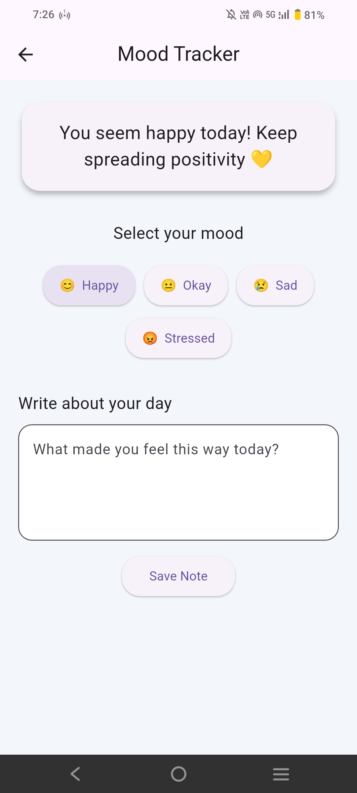
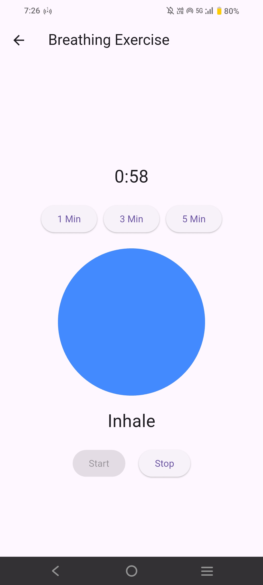
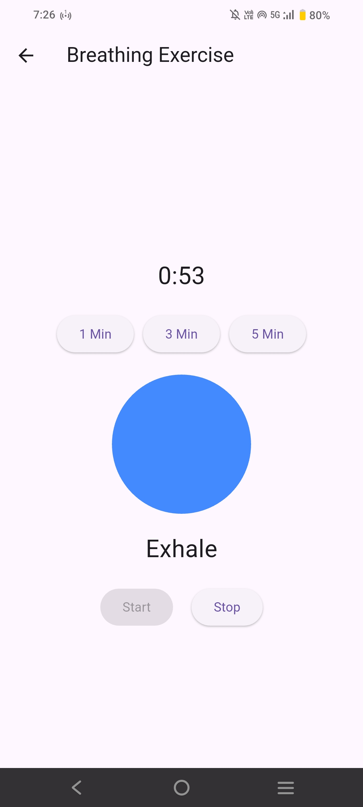
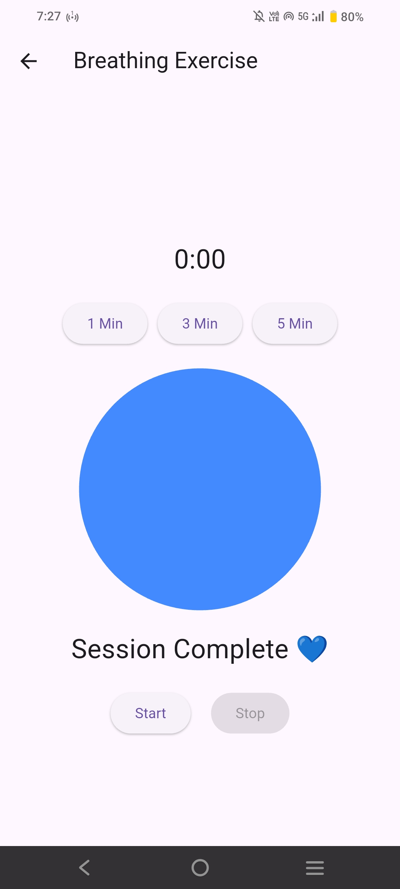

# Sweet Journal

A simple and calming digital wellbeing mobile application built with Flutter.

**Sweet Journal** helps users reflect on their emotions, track moods, and practice mindful breathing — all in a clean, pastel-themed interface.

---

## Features

- **Mood Tracker** – Log your mood with supportive feedback.
- **Journaling** – Simple text input for your daily thoughts.
- **Breathing Exercises** – Dedicated screen for mindfulness.
- **Daily Motivation** – Inspirational quotes on the home screen.
- **Beautiful UI** – Soft pastel gradients for a calming experience.
- **Cross-Platform** – Built with Flutter for Android & iOS.

---

##  Screenshots

### App Thumbnail


### Mood Tracker


### Breathing Exercise(Inhaling)


### Breathing Exercise(Exhaling)


### Session Complete


---


## 🛠️ Tech Stack

- **Framework:** Flutter
- **Language:** Dart
- **Platform:** Android SDK

---

##  Getting Started

Follow these steps to run the project locally.

### 1️⃣ Clone the Repository
```bash
git clone https://github.com/YOUR_USERNAME/sweet-journal.git
```

### 2️⃣ Navigate to the Project Directory
```bash
cd sweet-journal
```

### 3️⃣ Install Dependencies
```bash
flutter pub get
```

### 4️⃣ Run the App
```bash
flutter run
```

---

##  Build APK

To generate a release APK for Android:

```bash
flutter build apk --release
```

The APK will be located at:
`build/app/outputs/flutter-apk/app-release.apk`

---

##  Future Improvements

- [ ] Save journal entries locally (SQLite/Hive)
- [ ] Mood history tracking & charts
- [ ] Dark mode support
- [ ] Streak counter for daily logging
- [ ] Google Play Store release

---

##  Author

**Developed by Shanmuga Priya**

Built as a personal mental wellness Flutter project.
